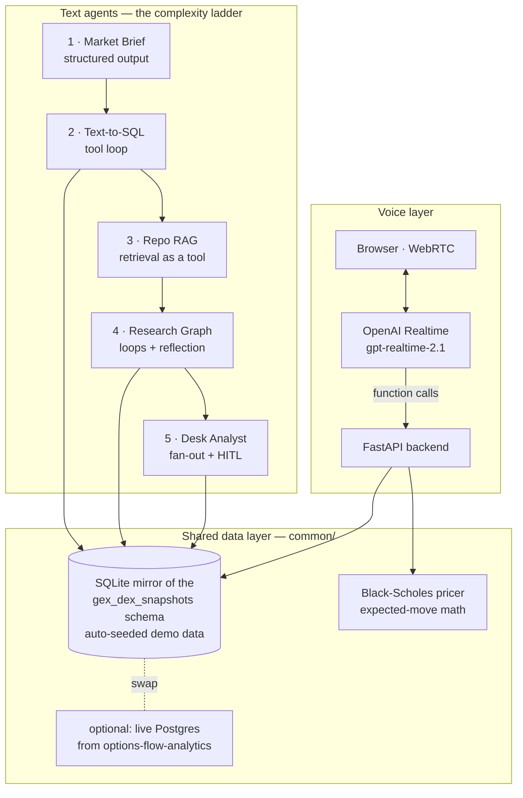

# ai-trading-desk

[](https://github.com/igorfyago/ai-trading-desk/actions/workflows/ci.yml)

**Six AI agents that staff an options trading desk — a deliberate ladder from a single LLM call to multi-path LangGraph workflows and real-time voice agents.**

Built with **LangChain 1.0** and **LangGraph 1.0** (Python), the **OpenAI Realtime API** for speech-to-speech voice, and grounded in a real system: my [options-flow-analytics](https://github.com/igorfyago/options-flow-analytics) service (Rust + PostgreSQL + Node.js), which computes live dealer gamma/delta exposure (GEX/DEX) from option chains. Every agent works out of the box on a bundled, auto-seeded SQLite mirror of that production schema — clone, add one API key, run.

Each level introduces exactly one new set of concepts on top of the previous one. The point of the repo is the *ladder*: read them in order and you've walked from "prompt" to "production agent system."

| # | Agent | Framework | New concepts | |
|---|---|---|---|---|
| 1 | [Market Brief](agents/01_market_brief/) | LangChain | structured output, prompt-as-persona | one LLM call, zero tools |
| 2 | [Text-to-SQL](agents/02_text_to_sql/) | LangChain | tool loop, self-correction on SQL errors, guardrails | English → verified SQL over the GEX database |
| 3 | [GEX Repo Interpreter](agents/03_repo_interpreter/) | LangChain | embeddings, agentic RAG, citations | answers "how does the code work?" over the real repo |
| 4 | [Research Graph](agents/04_research_graph/) | LangGraph | StateGraph, conditional edges, reducers, reflection loop | plan → multi-tool research → critic → revise |
| 5 | [Desk Analyst](agents/05_desk_analyst/) | LangGraph | routing, parallel sub-agents + join, critique loop, **human-in-the-loop interrupt**, checkpointing | regime-routed signal memo, human must approve |
| 6 | [Voice Agents](agents/06_voice/) | OpenAI Realtime | speech-to-speech, WebRTC, ephemeral credentials, server-side tools | 3 voice agents: generalist receptionist, generalist quoting agent, and an **AI Options Desk** that tells you the exact GEX trade |

**+ [the web app](web/)** — one big conversation UI over all of it: switch agents mid-chat, watch tools fire as chips, approve the desk analyst's memo with buttons, and **press the mic to talk to any agent** (a Realtime "voice bridge" wraps the text agents, so you can literally have a phone call with a LangGraph).

## The system at a glance



## Quickstart

```bash
git clone https://github.com/igorfyago/ai-trading-desk && cd ai-trading-desk
python -m venv .venv && .venv\Scripts\activate     # Windows (source .venv/bin/activate on mac/linux)
pip install -e ".[web]"
copy .env.example .env                              # add your OPENAI_API_KEY

python -m common.db                                 # build + seed the demo database
python agents/01_market_brief/main.py "Is SPY pinned into Friday opex?"
python agents/02_text_to_sql/main.py "Top 5 put walls by strength, with spot at the time"
python agents/04_research_graph/main.py "Compare dealer positioning on SPY vs QQQ"
python agents/05_desk_analyst/main.py SPY           # pauses for your approval before publishing
uvicorn web.server:app --reload                     # http://localhost:8000 → talk to the desk
```

Agent 3 additionally needs a checkout of [options-flow-analytics](https://github.com/igorfyago/options-flow-analytics) (`GEX_REPO_PATH` in `.env`), then `--index` once.

## The web app

`uvicorn web.server:app` serves a single-page app that puts all six agents in **one conversation**:

- **Agent switcher** — the full ladder in the sidebar; switch mid-conversation, the transcript keeps flowing.
- **Live execution view** — LangGraph node progress and tool calls render as chips while the agent works; answers stream in.
- **Human-in-the-loop in the UI** — when the Desk Analyst wants to publish, the chat shows the memo with *Approve / Request changes / Reject* buttons wired to `interrupt()`/`Command(resume=…)`.
- **Voice on every agent** — the three voice-native personas talk directly; for the text agents a **voice bridge** mints a Realtime session whose only tool is `ask_agent`, so the model converses naturally and delegates the thinking to the LangChain/LangGraph agent server-side. Approving the analyst's memo *by voice* works too.

## Observability (LangSmith)

Every chat run, every graph node, every sub-agent and **every voice tool call** is traced. Setup is three env vars in `.env` (`LANGSMITH_API_KEY`, `LANGSMITH_TRACING=true`, `LANGSMITH_PROJECT=ai-trading-desk`) — LangChain/LangGraph pick them up automatically, and the voice path is instrumented with `@traceable`. Web runs are tagged (`web-ui`, agent id, session) so you can filter one user's conversation, inspect the Desk Analyst's parallel branches, token costs, and latencies, or replay a failing SQL loop step by step.

## Testing

```bash
pip install -e ".[web,dev]"
pytest                    # 48 unit + integration tests, no API key needed, ~6s
RUN_LIVE=1 pytest tests/integration/test_live.py   # opt-in: real API round-trips
```

The suite is designed around what can go wrong in an agent system, not just line coverage:

- **Unit** — pricing math *properties* (put-call parity, delta bounds, monotonicity), all five branches of the trade engine, seed determinism, and **SQL guardrails** (DML/DDL/multi-statement injection attempts must come back `REJECTED`, bad SQL must come back as feedback, never an exception).
- **Graph topology** — the LangGraph wiring *is* the design, so tests pin it: the research graph's two loops close, the analyst graph fans out from both playbooks to all three specialists and joins before synthesis.
- **Contract** — every tool a voice persona declares to OpenAI must have a matching server-side implementation with valid JSON schema.
- **Integration** — the FastAPI surface with a test client: NDJSON chat streams, voice tools writing real rows, and *clean failure*: with a bad key the stream must yield a structured `error` event, not a 500.
- **Live (opt-in)** — one real structured-output run and one real Realtime session mint.

CI runs the keyless suite on every push (badge above). Tests never spend tokens unless you set `RUN_LIVE=1`.

## Roadmap

- **Simple mode** — the same desk, explained so a 10-year-old gets it (agent output rewritten to plain language + voice)
- **Execution** — IBKR paper-trading integration so approved memos become staged orders (behind the same human-approval interrupt)
- **Signal fusion** — blend GEX with volume profile, VWAP σ-bands, RSI and pattern detection (the chart-reading traders do by eye, systematized)
- **Hosting** — AWS (single EC2 like options-flow-analytics, or ECS Fargate + ALB for TLS/WebRTC)

## Why finance, why GEX?

Dealer positioning — who is long/short gamma, where the walls are, where hedging flows flip from dampening to amplifying — is the lens this whole stack is built around, and I'd already built the analytics service. These agents are the natural next layer: natural-language access (level 2), institutional knowledge (level 3), research automation (levels 4–5), and a phone line (level 6) for a system that already existed. AI agents are most convincing when they sit on top of something real.

## Design principles

- **One new idea per level.** Each README has a diagram and a "concepts introduced" table; the code is written to be read top-to-bottom.
- **The LLM is never trusted.** Read-only SQL with keyword guardrails, row caps, recursion limits, bounded loops, a risk-critic gate, and a human interrupt before anything is published. Voice tools execute server-side only.
- **Runs for anyone.** Deterministic synthetic seed data mirrors the production schema; `DATABASE_URL` swaps in the real feed without code changes.
- **Provider-agnostic where it's free.** All text agents go through `init_chat_model` — change `DESK_MODEL` in `.env` to swap OpenAI for Anthropic/Google/local.

## Repo layout

```
common/          shared model factory, demo DB (schema + seed), market math
agents/01..06    the ladder — each folder: main.py + README with diagram
web/             FastAPI token server + WebRTC voice demo page
```

---

*Demo data and indicative Black-Scholes quotes — nothing here is financial advice or an offer to trade.*
