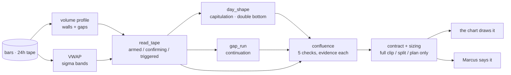

# minitrade

[](https://github.com/igorfyago/ai-trading-desk/actions/workflows/ci.yml)

**A live options-trading cockpit: a deterministic tape-reading engine, a 24-hour chart, and Marcus, the voice analyst you can talk to while the tape moves.**

**🟢 Live: [desk.b4rruf3t.com](https://desk.b4rruf3t.com)** · press the mic and ask *"what's the trade on SPY?"*. Grounded in real dealer-positioning data computed 24/7 by [options-flow-analytics](https://github.com/igorfyago/options-flow-analytics) on the same box, with its dashboard at [gex.b4rruf3t.com](https://gex.b4rruf3t.com). Delayed and demo-adjacent data. Nothing here is financial advice.

Part of a small estate of built-from-scratch systems, all reachable from [b4rruf3t.com](https://b4rruf3t.com).

## What this is

One host, one job. This repo is the trading app:

- **The engine** (`common/`) is deterministic and testable. It reads a tape into a stage machine (armed, confirming, triggered), scores confluence across five independent checks, recognises day shapes like capitulation and double bottoms, and prices contracts with Black-Scholes. No model decides what the trade is. The engine does, and Marcus reads it out.
- **The cockpit** (`web/trade/`) is the chart: 24-hour session colouring, visible-range volume profile, VWAP sigma bands, the levels the engine is watching, and a position book you can act on.
- **Marcus** (`agents/06_voice/personas.py`) is a speech-to-speech analyst on the OpenAI Realtime API. His tools run server-side and read the same engine the chart draws, so what he says and what you see cannot drift apart.

The five text agents that used to live here (the LangChain and LangGraph ladder, plus the agent builder) moved to **[agent-observatory](https://github.com/igorfyago/agent-observatory)**, where the subject is agents themselves: how they are wired, what they call, what they cost. Splitting them means each host is one thing instead of two half-things.

## The engine, briefly

Everything Marcus says traces back to one deterministic read:



The scorecard is the point: a setup with two of five checks green is sized differently from one with five, and the reason is attached to each box rather than summarised away.

## Quickstart

```bash
git clone https://github.com/igorfyago/ai-trading-desk && cd ai-trading-desk
python -m venv .venv && .venv\Scripts\activate   # source .venv/bin/activate on mac/linux
pip install -e ".[web]"
copy .env.example .env                            # add your OPENAI_API_KEY

python -m common.db                               # build and seed the demo database
uvicorn web.server:app --reload                   # http://localhost:8000
```

`/` is the cockpit. `/marcus` is Marcus on his own, which is also what the cockpit embeds.

## Testing

```bash
pip install -e ".[web,dev]"
pytest                                            # keyless, a few seconds
RUN_LIVE=1 pytest tests/integration/test_live.py  # opt-in, spends real tokens
```

The suite is built around what actually goes wrong in this system:

- **Pricing properties**, not examples: put-call parity, delta bounds, monotonicity.
- **The trade engine's branches**, including the ones that must refuse to fire.
- **The 24-hour quote contract**: once the extended tape has printed, a later provider round serving the frozen close must not blank it. That bug shipped twice before it got a test.
- **Tool contracts**: every tool Marcus declares to OpenAI has a server-side implementation with a valid schema, because a missing one only fails mid-call.
- **The API surface**, including that the departed chat routes really are gone. Dead routes are how you end up with two versions of the same thing.

CI runs the keyless suite on every push. Tests never spend tokens unless you set `RUN_LIVE=1`.

## Evals

Tests check the code. [evals](evals/) check Marcus's judgment: scripted calls run against the real persona and tools, then get graded on whether he used the engine, led with the trade in plain language, respected an established day rather than fighting it, and stayed off jargon unless asked. `python evals/voice_evals.py all`.

## Design principles

- **The model never decides the trade.** It reads out a deterministic engine. That is what makes the answer reproducible and the failure modes findable.
- **The model is never trusted with writes.** Voice tools execute server-side only.
- **One source of truth per fact.** The chart, Marcus, and the book read the same engine and the same quote layer. Two code paths for one number is two numbers eventually.
- **Runs for anyone.** Deterministic seed data mirrors the production schema, and `DATABASE_URL` swaps in the real feed without code changes.

## Deployment

Runs 24/7 on one EC2 box beside the real [options-flow-analytics](https://github.com/igorfyago/options-flow-analytics) pipeline, so in production the engine queries the live dealer-positioning Postgres and the bundled SQLite is a dev convenience. Caddy routes each hostname to its own service. Full write-up in [docs/DEPLOY_AWS.md](docs/DEPLOY_AWS.md), with [k8s/](k8s/) manifests validated in CI.

## Repo layout

```
common/          the engine: tape reading, signals, market math, quotes, demo DB
agents/06_voice/ Marcus: persona, tools, speech rules
web/             FastAPI backend, the trade cockpit, Marcus's page, the portal
evals/           graded voice evals for Marcus
tests/           unit + integration + opt-in live tests, CI gated
deploy/ k8s/     Docker Compose production stack, Kubernetes manifests
```

---

*Demo data and indicative Black-Scholes quotes. Nothing here is financial advice or an offer to trade.*
