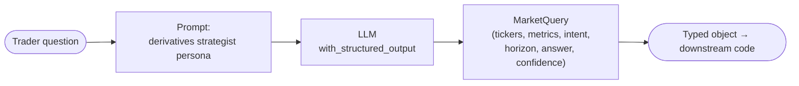

# Agent 1 — Market Brief

**Complexity level: 1/6 — a single LLM call with structured output. No tools, no loops, no state.**

The foundation every other agent builds on: instead of getting free text back from the model, we bind a Pydantic schema (`MarketQuery`) so the response is *typed data* — parseable tickers, metrics, intent, and a confidence score. This is the difference between "chatbot" and "component you can build a system out of."

## How it works



## Run it

```bash
python agents/01_market_brief/main.py "Is SPY pinned by dealers into Friday opex?"
```

## What to notice

- `model.with_structured_output(MarketQuery)` — the model is forced to emit valid JSON matching the schema; Pydantic validates it. Field descriptions double as instructions to the model.
- There is **no agent loop here**. One request, one response. Every level after this adds one new concept on top.

## Concepts introduced

| Concept | Where |
|---|---|
| Structured output | `with_structured_output(MarketQuery)` |
| Prompt-as-persona | `SYSTEM` prompt |
| Provider-agnostic models | `common/llm.py` → `init_chat_model` |
