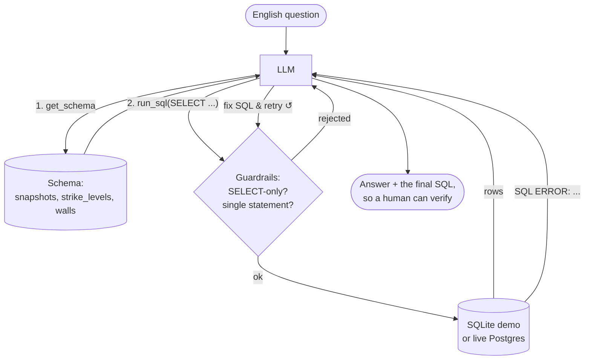

# Agent 2 — Text-to-SQL

**Complexity level: 2/6 — the first true agent: a tool loop with self-correction.**

English in, verified numbers out. The model is given two tools — `get_schema` and `run_sql` — and left to figure out the rest. The key mechanic: **SQL errors are returned to the model as tool results, not raised as exceptions**, so a bad query becomes feedback and the agent fixes its own SQL. This retry-on-error loop is what separates an agent from a chain.

The database is a normalized SQLite mirror of the production [`options-flow-analytics`](https://github.com/igorfyago) `gex_dex_snapshots` schema (auto-seeded with deterministic synthetic data — clone and run, no setup). Set `DATABASE_URL` and the same agent runs against the live Postgres.

## How it works



## Run it

```bash
python agents/02_text_to_sql/main.py "Which ticker had the most negative-gamma snapshots, and what was its average VIX in that regime?"
python agents/02_text_to_sql/main.py "Show the 5 biggest put walls by strength and the spot price at the time"
python agents/02_text_to_sql/main.py "For SPY, how far was spot from the gamma flip on average, by traffic light?"
```

## What to notice

- **Guardrails before execution**: read-only keyword filter, single-statement rule, row cap. The LLM is never trusted with write access — rejections are worded so the model can adapt.
- **The error path is a feature**: `SQL ERROR: no such column: vix_current` teaches the model the real schema faster than any prompt could.
- **Answer + SQL**: the system prompt requires the final SQL in the answer — verifiability is the product.

## Concepts introduced (on top of level 1)

| Concept | Where |
|---|---|
| `create_agent` tool loop | `build_agent()` |
| Tool design & docstrings-as-API | `get_schema`, `run_sql` |
| Self-correction via tool errors | `SQL ERROR:` return path |
| Guardrails / least privilege | `FORBIDDEN`, `MAX_ROWS` |
| `recursion_limit` safety valve | `agent.invoke(..., config)` |
