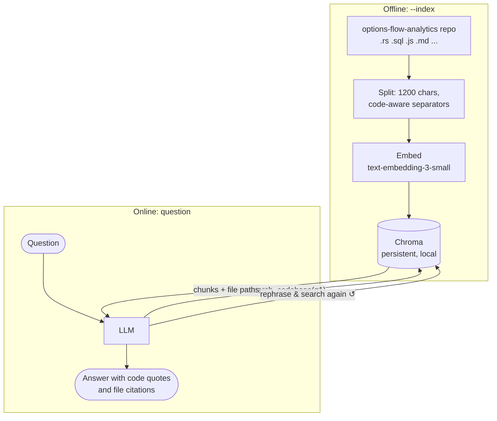

# Agent 3 — GEX Repo Interpreter

**Complexity level: 3/6 — retrieval-augmented agent (RAG) over a real production codebase.**

This agent answers "how does the system actually work?" questions about [options-flow-analytics](https://github.com/igorfyago) — the Rust + PostgreSQL + Node.js service that computes dealer gamma/delta exposure live from option chains. Ask it *"how is the gamma flip computed?"* and it retrieves the actual Rust, quotes it, and cites the file.

Two design choices matter here:

1. **Retrieval is a tool, not a pipeline step.** Classic RAG retrieves once, then generates. Here the model holds `search_codebase` and decides *when* and *how often* to search — multi-part questions trigger multiple searches with different phrasings. Agentic RAG > fixed RAG.
2. **MMR retrieval** (maximal marginal relevance) so six chunks about the same function don't crowd out the schema and API layers.

## How it works



## Run it

```bash
# one-time (and after the repo changes):
python agents/03_repo_interpreter/main.py --index

python agents/03_repo_interpreter/main.py "How is the gamma flip level computed, end to end?"
python agents/03_repo_interpreter/main.py "Where do call/put walls come from and how are they ranked?"
python agents/03_repo_interpreter/main.py "Trace a snapshot from CBOE fetch to the dashboard"
```

## Concepts introduced (on top of level 2)

| Concept | Where |
|---|---|
| Embeddings + persistent vector store | `build_index()` → Chroma |
| Chunking strategy for code | `RecursiveCharacterTextSplitter(separators=[..., "\nfn ", ...])` |
| Agentic RAG (retriever-as-tool) | `search_codebase` |
| MMR retrieval for diversity | `search_type="mmr"` |
| Grounding + citation discipline | `SYSTEM` rules |
