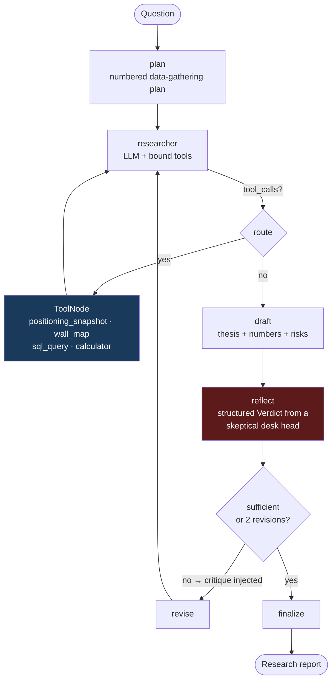

# Agent 4 — Market Research Graph

**Complexity level: 4/6 — explicit LangGraph orchestration: two visible loops, conditional routing, a critic.**

Levels 1–3 used `create_agent`, where the loop is implicit. Here the workflow becomes a **StateGraph** you can draw: a planner writes a data-gathering plan, a researcher executes it with four tools (inner loop), a drafter writes the note, and a **skeptical reviewer node** either accepts it or kicks it back with a critique (outer reflection loop, bounded at 2 revisions). This is the step where "agent" becomes "system": each phase is a node with its own prompt, state, and failure handling.

## How it works



Loop 1 (`researcher ⇄ tools`) is the level-2 tool loop made explicit. Loop 2 (`reflect → revise → researcher`) is new: self-correction at the *workflow* level — the critique becomes a message in the researcher's transcript, so the next pass gathers exactly the missing data.

## Run it

```bash
python agents/04_research_graph/main.py "Compare dealer positioning on SPY vs QQQ right now and what it implies for tomorrow"
python agents/04_research_graph/main.py "Is IWM's gamma regime stable or flipping? Quantify it over the last week"
```

## Concepts introduced (on top of level 3)

| Concept | Where |
|---|---|
| `StateGraph` + typed state | `ResearchState` |
| Reducers (`operator.add`) for message accumulation | `messages: Annotated[list, operator.add]` |
| Conditional edges | `route_research`, `route_reflection` |
| Explicit inner tool loop | `tools → researcher` edge |
| Bounded reflection loop | `reflect → revise`, `MAX_REVISIONS` |
| Structured verdicts as router input | `Verdict` model |
| `ToolNode(handle_tool_errors=True)` | errors → ToolMessages, LLM recovers |
| Streaming node-by-node progress | `graph.stream(..., stream_mode="updates")` |
