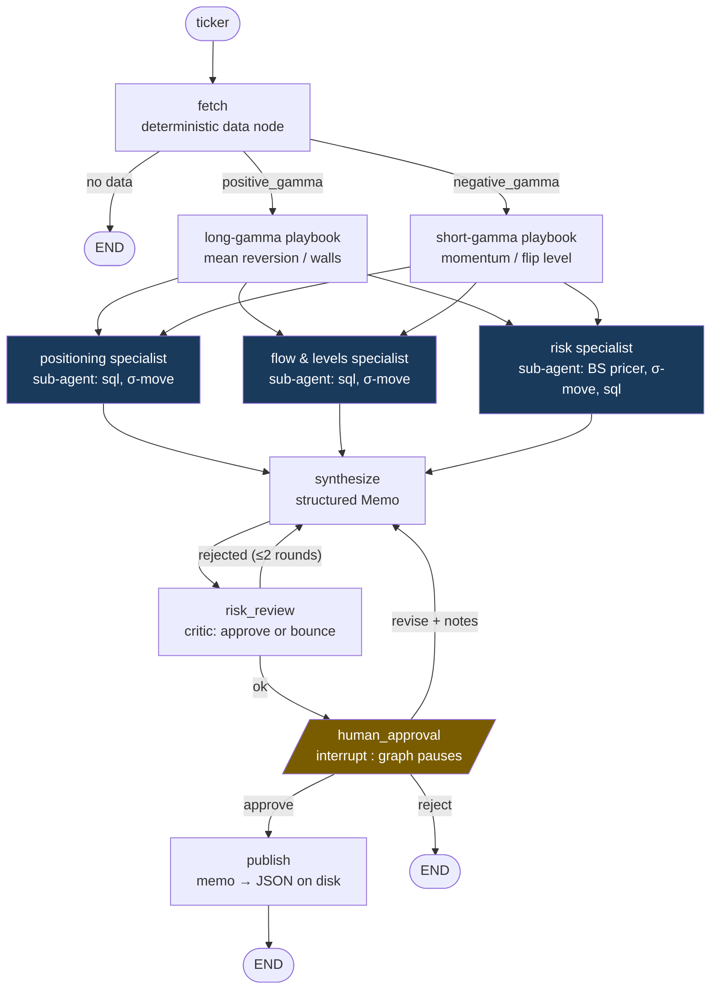

# Agent 5 — GEX Trading-Desk Analyst

**Complexity level: 5/6 — the full toolbox: routing, parallel sub-agents, critique loop, human-in-the-loop, durable state.**

One command — `python agents/05_desk_analyst/main.py SPY` — runs an entire desk workflow: pull the latest dealer-positioning snapshot, branch on the gamma regime, fan out **three specialist sub-agents in parallel** (each a complete tool-loop agent of its own), merge their work into a structured signal memo, pass it through a risk-manager critic that can bounce it back, then **pause the whole graph** and wait for a human to approve, request changes, or kill it. Only an approved memo gets published to disk.

## How it works



## The six mechanisms, and where to read them

| Mechanism | Where | Why it matters |
|---|---|---|
| Router via `Command(goto=...)` | `fetch()` — updates state AND picks the branch | one node, two regime paths |
| Deterministic nodes (no LLM) | `fetch`, both playbooks, `publish` | not everything needs a model |
| Parallel fan-out + join | edges playbook→3 specialists, `add_edge([...], "synthesize")` | 3 sub-agents run concurrently; join waits for all |
| Sub-agents as nodes | `_specialist()` — `create_agent` invoked inside a node | composition: an agent is just a node |
| Bounded critique loop | `risk_review → synthesize` (max 2 rounds) | quality gate before any human sees it |
| Human-in-the-loop | `interrupt()` + `Command(resume=...)` + checkpointer | the graph *pauses*; state survives; side effects only after approval |

Note the idempotency discipline: `publish` (the side effect) sits **after** the interrupt, because everything before `interrupt()` re-runs on resume.

## Run it

```bash
python agents/05_desk_analyst/main.py SPY
# ... graph runs, then pauses:
# — HUMAN APPROVAL REQUIRED —  {memo}
# approve / revise / reject?  revise
# notes: conviction too high given mixed DEX — cut to 5 and add a hedge
# ... loops back through synthesis and review, pauses again ...
```
