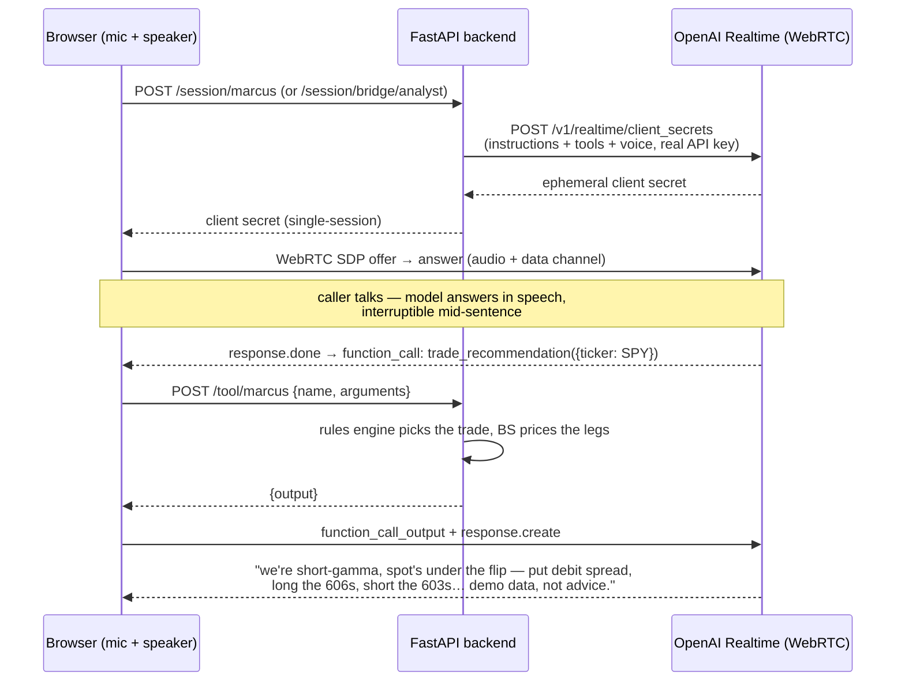

# Agent 6 — Voice Agents

**Complexity level: 6/6 — real-time speech-to-speech agents with server-side tools, spanning the two big commercial use cases plus the desk's specialty.**

Three personas on the **OpenAI Realtime API** (`gpt-realtime-2.1`, true speech-to-speech — no STT→LLM→TTS pipeline, so interruptions, hesitation and tone work natively):

| Persona | Voice | What it shows |
|---|---|---|
| **Riley — AI Receptionist** (Northline Dental) | `marin` | the classic local-business agent: hours, services, and **real appointment booking** (DB write) with a collect-then-confirm flow |
| **Quinn — AI Quoting Agent** (BrightBuild Renovations) | `sage` | the sales-ops agent: turns a fuzzy project description into a priced estimate via a deterministic rate engine, saves the quote for follow-up |
| **Marcus — AI Options Desk** | `cedar` | the specialist: tells you the **exact trade** — structure, strikes, expiry, invalidation, sizing — for the current GEX regime |

Riley and Quinn are deliberately **generalist** (this is what most voice-agent client work looks like); Marcus is the desk's own. The key design rule for Marcus: **the LLM never picks strikes.** A rules engine ([common/signals.py](../../common/signals.py)) maps regime → structure deterministically (short gamma + below flip → put debit spread into the wall; long gamma → sell the walls / iron condor), prices the legs with Black-Scholes, and the model only *narrates* it — decide-in-code, explain-in-model.

There's also a fourth, dynamic persona: the **voice bridge** (`/session/bridge/{agent}`), which gives any *text* agent a voice. Its only tool is `ask_agent`; the Realtime model handles the conversation and delegates the thinking to the LangChain/LangGraph agent on the server — including reading the Desk Analyst's memo aloud and taking your approve/revise/reject **by voice**.

## How it works

## Try it (web app → mic button)

- **Riley**: *"My tooth hurts, can I come in tomorrow?"* → empathy + earliest slot + booking flow
- **Quinn**: *"What would repainting a 2,000 sq ft house cost?"* → estimate range + duration + saved quote
- **Marcus**: *"What's the trade on SPY right now?"* → regime, exact spread, why, where it's wrong, sizing — and the mandatory demo-data disclaimer
- **Bridge on the Desk Analyst**: *"Run the desk on QQQ"* → three specialists run server-side → the memo is read to you → *"approve it"*

## Concepts introduced (on top of level 5)

| Concept | Where |
|---|---|
| Speech-to-speech (no pipeline) | `gpt-realtime-2.1` session |
| Ephemeral credentials | `POST /v1/realtime/client_secrets` in `web/server.py` |
| Server-side tools for a client-side model | `POST /tool/{persona}` round-trip |
| Decide-in-code / explain-in-model | `common/signals.py` + Marcus's instructions |
| Voice bridge (voice ↔ any text agent) | `/session/bridge/{agent}` + `ask_agent` |
| HITL by voice | bridge `resolve_approval` tool |
| Voice-tool tracing | `@traceable` on `run_tool` → LangSmith |
